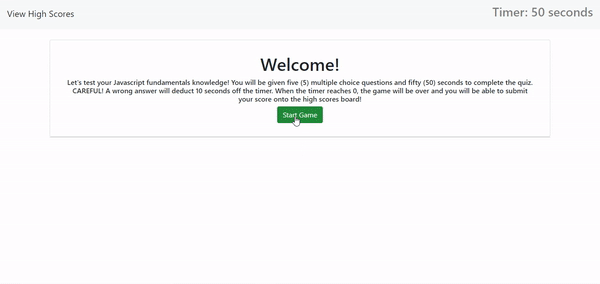

Welcome to the Javascript Fundamentals Quiz where I will test your Javascript knowledge!

Live deployed URL: https://junkoyama.github.io/Javascript-Fundamentals-Quiz/ 

This week's homework challenged me to think critically and thoroughly plan my action steps. First I envisioned how I would design a unique quiz so I could provide an easy to read and accessible interface. Secondly I went back to past class activities to help review concepts that could steer me to write creative JavaScript code. Lastly I spent 2 tutor sessions with my tutor, Paolo Razon, and worked with 2 different Learning Assistants from askBCS to learn different ways of writing code with the same output. These sessions broadened my knowledge with HTML, CSS and JavaScript so that I can become a better developer.


# 04 Web APIs: Code Quiz

## My Task

As I proceed in your journey to becoming a full-stack web developer, it’s likely that I'll be asked to complete a coding assessment, perhaps as part of an interview process. A typical coding assessment is a combination of multiple-choice questions and interactive coding challenges. 

To help myself become familiar with these tests and get a chance to apply the skills from this module, this week’s homework invites me to build a timed coding quiz with multiple-choice questions. This app will run in the browser, and will feature dynamically updated HTML and CSS powered by JavaScript code that I will write. It will have a clean, polished, and responsive user interface. This week’s coursework will teach me all the skills I need to succeed in this assignment.


## User Story

```
AS A coding boot camp student
I WANT to take a timed quiz on JavaScript fundamentals that stores high scores
SO THAT I can gauge my progress compared to my peers
```


## Acceptance Criteria

```
GIVEN I am taking a code quiz
WHEN I click the start button
THEN a timer starts and I am presented with a question
WHEN I answer a question
THEN I am presented with another question
WHEN I answer a question incorrectly
THEN time is subtracted from the clock
WHEN all questions are answered or the timer reaches 0
THEN the game is over
WHEN the game is over
THEN I can save my initials and score
```


## Brief Preview of Final Homework

The following animation demonstrates my final work on the quiz:




## Grading Requirements

This homework is graded based on the following criteria: 

### Technical Acceptance Criteria: 40%

* Satisfies all of the above acceptance criteria.

### Deployment: 32%

* Application deployed at live URL.

* Application loads with no errors.

* Application GitHub URL submitted.

* GitHub repository that contains application code.

### Application Quality: 15%

* Application user experience is intuitive and easy to navigate.

* Application user interface style is clean and polished.

* Application resembles the mock-up functionality provided in the homework instructions.

### Repository Quality: 13%

* Repository has a unique name.

* Repository follows best practices for file structure and naming conventions.

* Repository follows best practices for class/id naming conventions, indentation, quality comments, etc.

* Repository contains multiple descriptive commit messages.

* Repository contains quality README file with description, screenshot, and link to deployed application.


## Review

You are required to submit BOTH of the following for review:

* The URL of the functional, deployed application.

* The URL of the GitHub repository. Give the repository a unique name and include a README describing the project.

- - -
© 2020 Trilogy Education Services, a 2U, Inc. brand. All Rights Reserved.
